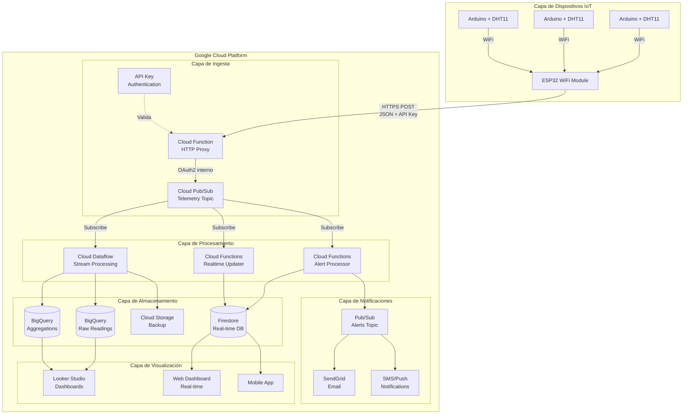
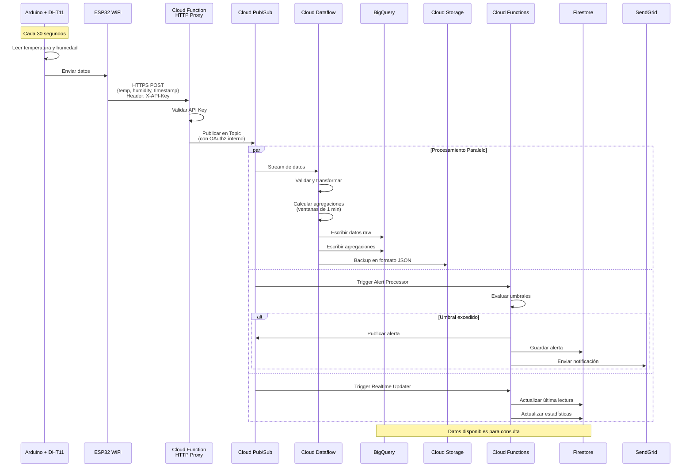
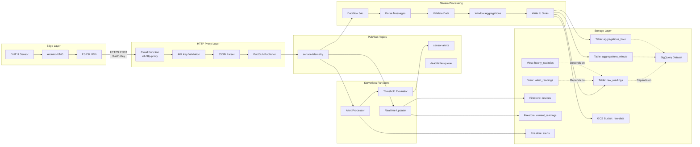
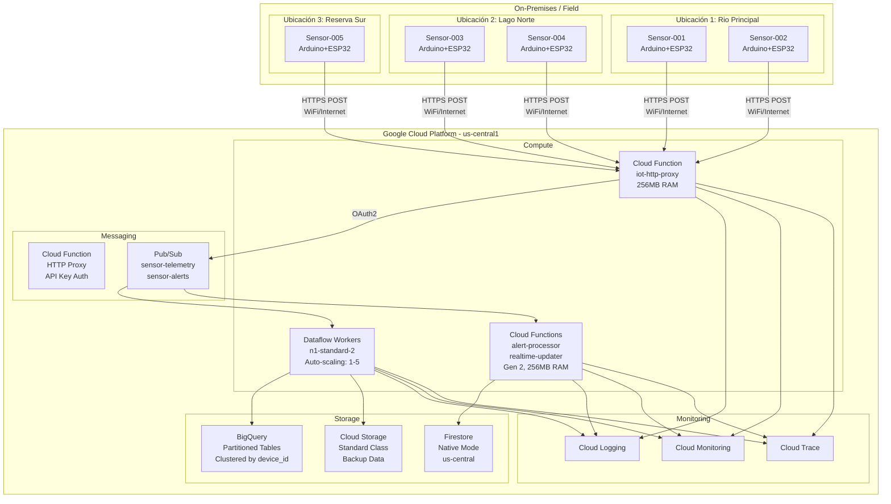
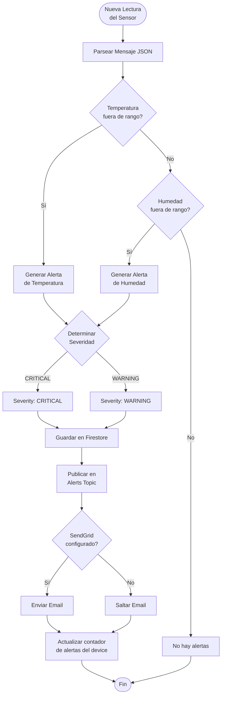
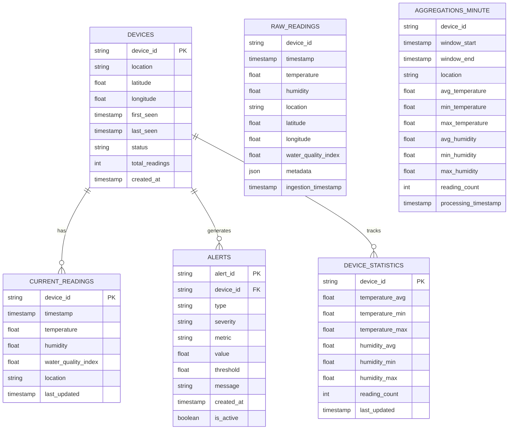
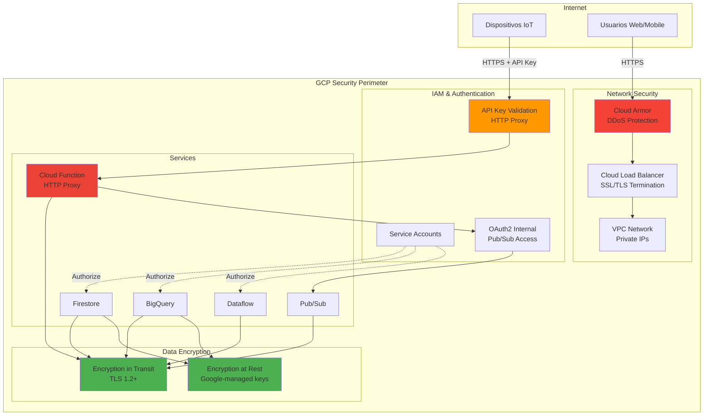

# Diagramas de Arquitectura - Sistema IoT de Monitoreo de Calidad de Aguas

**ACTUALIZADO 2026**: Arquitectura sin Cloud IoT Core (deprecado), usando Cloud Function HTTP Proxy.

## 1. Diagrama de Arquitectura de Alto Nivel (ACTUALIZADO)



## 2. Diagrama de Flujo de Datos



## 3. Diagrama de Componentes Detallado



## 4. Diagrama de Despliegue



## 5. Diagrama de Procesos de Alertas



## 6. Diagrama de Modelo de Datos



## 7. Diagrama de Red y Seguridad



## 8. Diagrama de Escalabilidad y Auto-scaling

```mermaid
graph LR
    subgrapHTTP Requests<br/>to Proxy]
    end
    
    subgraph "Auto-scaling Policies"
        P1[Dataflow<br/>Min: 1 worker<br/>Max: 5 workers]
        P2[Cloud Functions<br/>HTTP Proxy<br/>Max: 10 instances]
        P3[Cloud Functions<br/>Processors<br/>Max: 100 instances]
    end
    
    subgraph "Scaled Resources"
        R1[Dataflow Worker 1]
        R2[Dataflow Worker 2]
        R3[Dataflow Worker N]
        R4[Proxy Instance 1]
        R5[Proxy Instance N]
        R6[Function Instance 1]
        R7[Function Instance N]
    end
    
    M1 --> P1
    M2 --> P1
    M3 --> P2
    
    P1 -.->|Scale Up/Down| R1 & R2 & R3
    P2 -.->|Scale Up/Down| R4 & R5
    P3 -.->|Scale Up/Down| R6 & R7
    
    P1 -.->|Scale Up/Down| R1 & R2 & R3
    P2 -.->|Scale Up/Down| R4 & R5
    
```
